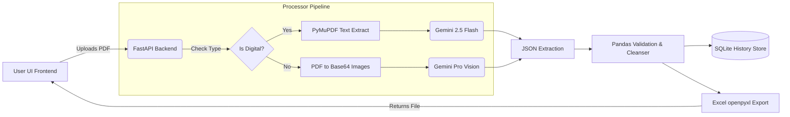

<div align="center">
  <div style="background: linear-gradient(135deg, #00c896, #0070c0); padding: 5px; border-radius: 20px; display: inline-block;">
    <h1 align="center" style="margin: 0; padding: 15px 30px; background: #080e1a; border-radius: 15px; color: white;">
      ⚡ StatementAI
    </h1>
  </div>
  <p align="center"><b>Intelligent Bank Statement Parsing & Financial Analytics Pipeline</b></p>
  <p align="center">
    
    
    
    
  </p>
</div>

<br/>

> 💼 **Built specifically to solve real-world problems in Chartered Secretary (CS) accounting firms.** This tool eliminates hours of manual data entry by extracting, categorising, and structuring transactions from chaotic PDF bank statements using Generative AI.

---

## 📸 Demo overview
*(Placeholder: Record a 90-second screen recording showing the drag-and-drop flow, history loading, charts rendering, and excel export. Add a GIF or YouTube link here before your interview!)*


---

## 🎯 The Problem & Solution

**The Pain Point**: Accountants manually transcribe every single bank transaction from clunky PDFs (often scanned) into Excel for tax reconciliation and GSTR-2B filings. Traditional OCR tools fail on inconsistent table structures and digital artifacts. 
**The Solution**: StatementAI provides a hybrid pipeline. It automatically detects digital vs. scanned PDFs, leverages PyMuPDF and Tesseract, and feeds the raw visual/text data into **Google Gemini Vision AI** to reliably extract, categorise, and validate transaction data from any Indian bank (SBI, HDFC, Axis, Standard Chartered). 

## ✨ Key Features
- **Multi-Bank Formatting**: Graceful extraction regardless of column alignments or multi-date edge cases.
- **Auto-Categorisation**: AI tags expenses automatically (Food, EMI, Transport, Utilities, etc.).
- **Data Validation Engine**: Flags anomalies (e.g., negative balances or missing debit/credits) mechanically via Pandas.
- **Analytics Dashboard**: Real-time spending donut charts and interactive statistics powered by Recharts.
- **Database History**: Embedded SQLite instance persisting and logging all parsing workloads automatically.
- **One-Click Export**: Converts data dynamically into beautifully formatted Excel spreedsheets.

---

## 🧠 System Architecture



---

## 🚀 Running Locally

You'll require `npm` and `python` installed. Ensure your `GEMINI_API_KEY` is available.

### Backend Setup
```bash
cd backend
python -m venv venv_bank
source venv_bank/bin/activate
pip install -r requirements.txt

# Create a .env file and add: GEMINI_API_KEY=your_key_here
echo "GEMINI_API_KEY=xxx" > .env

# Run FastAPI server
uvicorn main:app --reload
```

### Frontend Setup
```bash
cd frontend
npm install
npm run dev
```

---

## ☁️ Deployment
The backend has been configured with a `Dockerfile` targeting extremely lightweight resource consumption. 
- A GitHub actions pipeline (`.github/workflows/python-app.yml`) is integrated for PR code validation.
- Ready to host on [Render](https://render.com/) or similar PaaS solutions.